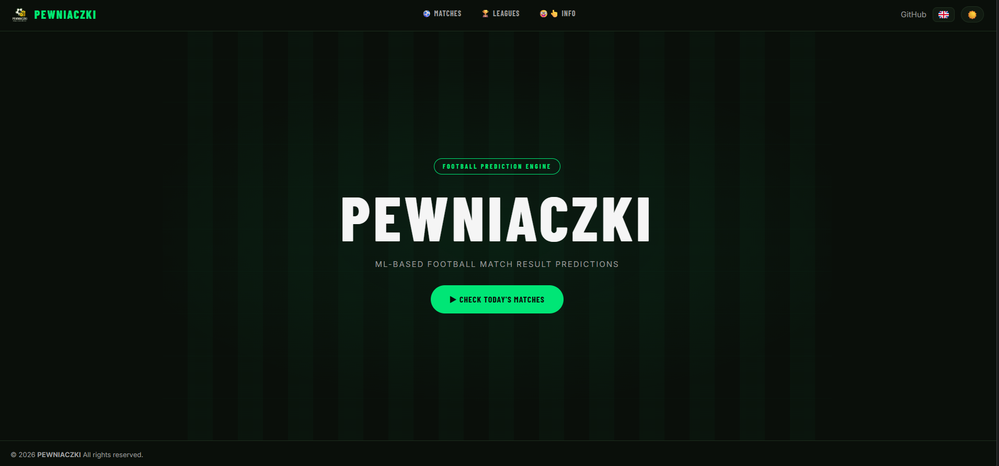
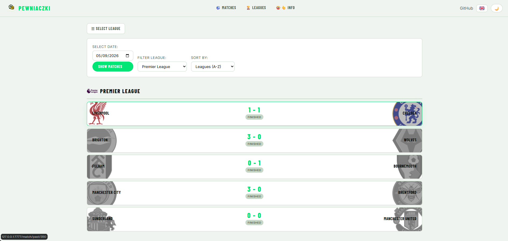
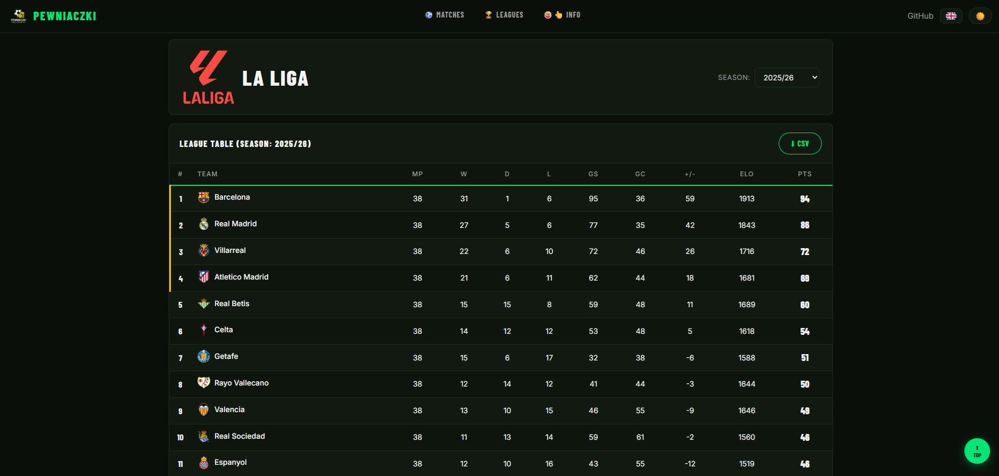
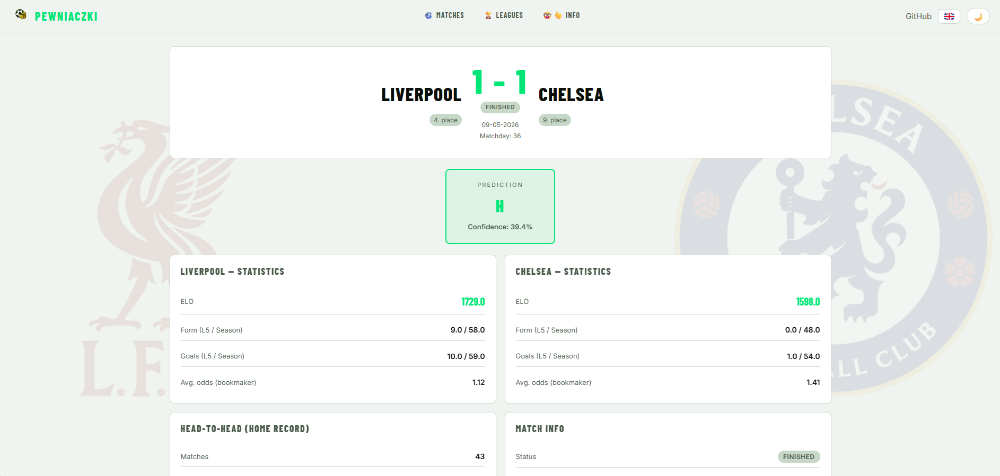
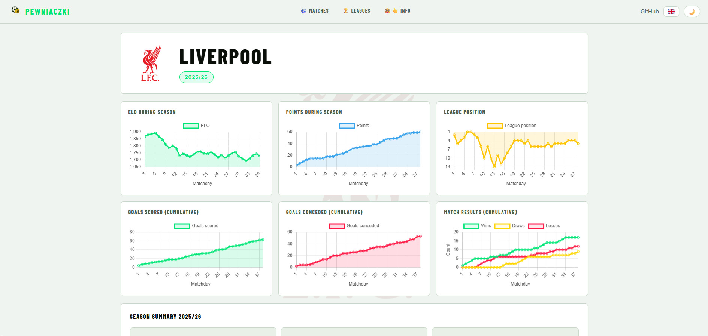
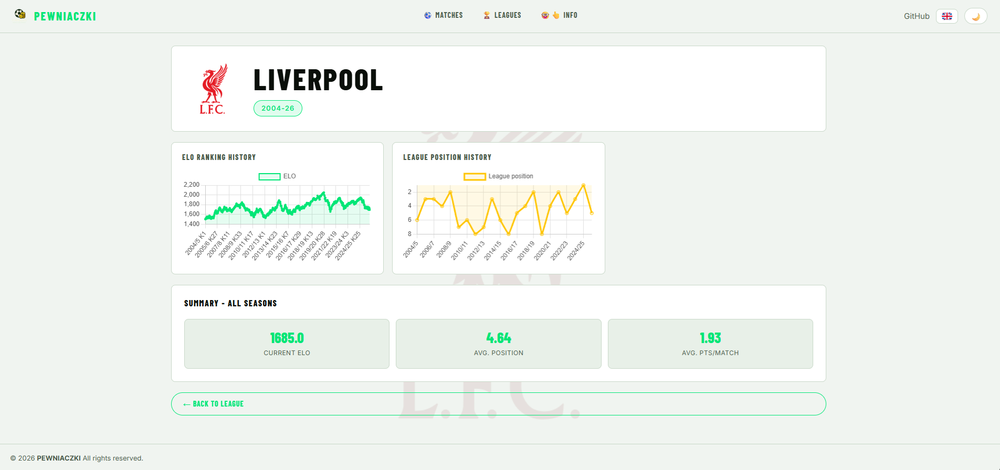
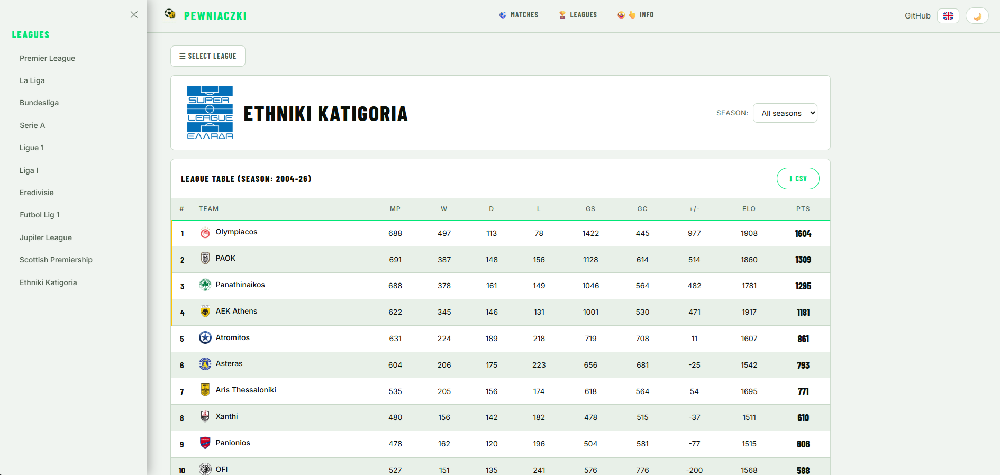

# IPZ-Pewniaczki

## About the Project

IPZ-Pewniaczki is an academic project focused on developing a system for predicting football match results. It encompasses several key components:

1. **Data Scraping**: Gathering historical match data and future fixture information from various online sources.
2. **Data Processing and Feature Engineering**: Calculating advanced statistical metrics, ELO ratings, and team form/head-to-head (H2H) statistics.
3. **Prediction Model**: Training a machine learning model (XGBoost and Neural Network) to predict match outcomes (Home Win, Draw, Away Win).
4. **Web Application (Flask)**: Providing an interactive interface for users to browse match details, league standings, team profiles, and view predictions.

## Screenshots

### Landing Page



### Main Page (Matches)



### League View



### Match Detail



### Team Season Profile



### Team All-Season Profile



### League selection



## Features
- **Top 10 tracked leagues**: View the top 10 leagues with the most matches played and ELO ratings.
- **Over 400 clubs**: Access detailed information about over 400 football clubs with their respective historically accurate logos.
- **Comprehensive Match Details**: View historical and upcoming matches with detailed information, including:
  - Match date and time.
  - Home and Away teams.
  - League and Matchday.
  - Final score (for past matches).
  - Team ELO ratings and changes.
  - Team market values.
  - Team form (last 3, last 5, and season).
  - Goals scored in recent matches and season.
  - Team placements in league tables.
  - Head-to-Head (H2H) statistics.
  - Bookmaker odds statistics (mean, standard deviation, Shannon entropy, Gini index, HHI, Coefficient of Variation).
  - Consensus prediction from bookmakers.
  - "Surprise" indicator based on odds.
- **Match Predictions**: Displays predicted results for matches with a confidence score.
- **Interactive League Tables**: Browse league standings for various seasons, including an "All-Time" view.
- **Team Profiles**: Interactive team detail pages with season and all-time statistics, including:
  - ELO rating history (per season and all-time).
  - League position history.
  - Cumulative points, goals scored and goals conceded charts.
  - Cumulative match results (Win/Draw/Loss) chart.
  - Season summary statistics with league-wide rankings.
- **Theme Toggle**: Switch between light and dark modes for better user experience.
- **Multi-Language Support**: (Could be expanded to include more languages)
  - English
  - Polish

## Data Sources

The project scrapes data from the following sources:

- **Football-Data.co.uk**: Provides historical match data, including results and a wide range of bookmaker odds.

## Technical Stack

- **Backend**: Python 3.9
- **Web Framework**: Flask
- **Database**: SQLite
- **ORM**: SQLAlchemy
- **Data Manipulation**: Pandas, NumPy
- **Web Scraping**: BeautifulSoup4, Requests, httpx, fuzzywuzzy, chardet, unidecode
- **Machine Learning**: XGBoost, PyTorch (Neural Network)
- **Frontend**: HTML, CSS (custom, with Inter font), JavaScript (Chart.js for interactive charts)

## Project Structure

```
IPZ-Pewniaczki/
├── .github/
│   └── workflows/          # GitHub Actions for scheduled data refreshes
├── Docs/                   # Project documentation
│   └── screenshots/        # Application screenshots (see Screenshots section)
├── src/
│   ├── static/
│   │   ├── css/
│   │   │   ├── base.css
│   │   │   ├── team.css
│   │   │   └── ...
│   │   ├── js/
│   │   │   ├── base.js         # Global scripts: theme toggle, sidebar, scroll-to-top
│   │   │   ├── mainpage.js     # Matches page: fetching, filtering, sorting
│   │   │   ├── league_view.js  # League standings: active league highlight, season/matchday switch, CSV export
│   │   │   └── team.js         # Team profile: Chart.js charts (ELO, position, points, goals, W/D/L)
│   │   ├── logos/               # Team logos (256x256, 512x512)
│   │   └── flags/                # Language flag icons
│   ├── templates/
│   │   ├── base.html            # Shared layout (navbar, sidebar, footer)
│   │   ├── MainPage.html        # Matches listing page
│   │   ├── league_view.html     # League standings page
│   │   ├── match_detail.html    # Single match detail page
│   │   ├── team.html            # Team profile page
│   │   └── index.html           # Landing / info page
│   ├── models.py                # SQLAlchemy models
│   ├── db.py                    # Database connection setup
│   └── routes/                  # Flask blueprints (main, leagues, teams, matches)
├── requirements.txt
└── README.md
```

## Setup

```bash
git clone https://github.com/Aleksoooxd/IPZ-Pewniaczki.git
cd IPZ-Pewniaczki
pip install -r requirements.txt
```


